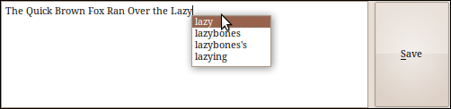

:Author: Neil Wallace (rowinggolfer AT googlemail.com)
:Release: |release|
:Date: |today|

    This widget combines a :doc:`CompletionTextEdit` and a :class:`QtGui.QPushButton`
    
    Allows rapid text entry (using the system dictionary), and emits a Save signal
    when the pushbutton is pressed. See :func:`~<KLASS>.emit_save`

.. note::
    see :doc:`DictionaryCompleter` about the paths for your dictionary. 
