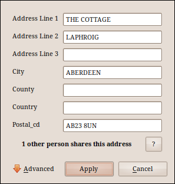

:Author: Neil Wallace (neil@openmolar.com)
:Release: |release|
:Date: |today|
   
The dialog raised when a patient's address requires input
handles logic to raise new address dialogs,
or links to known addresses etc.

