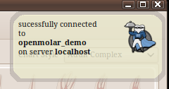

:Author: Neil Wallace (neil@openmolar.com)

This class is how I get openmolar to give notifications to the user.

I wanted a non-intrusive popup to appear in the top-right corner of both the client and admin applications, very similar to 
the notification system of the gnome desktop.

However.. openmolar is cross-platform, and the notification standards of all desktops seem to be a moving 
target. So I wrote my own version. 

The Advisor has various levels of imoprtance.

- level 0 (a 5 second popup which can be "clicked through" and hopefully not interupt workflow)
    
- level 1 (an information dialog which has to be accepted)

- level 2 (a warning dialog. In this case the warning is also outputted to the terminal.)

I may experiment with pynotify or similar in future to provide some of this functionality.

