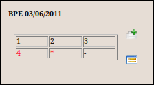

:Author: Neil Wallace (neil@openmolar.com)
:Release: |release|
:Date: |today|

This Widget, which displays the result of a basic periodontal exam is a component of :doc:`SummaryPage`

it emits 2 signals QtCore.SIGNAL("NewBPE") and QtCore.SIGNAL("ShowBPE")

