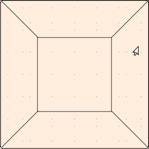

This class is a fusion between python and Qt functionality.

When an active QPainter is passed into draw_structure, this is drawn

When an active QPainter is passed into draw_restorations, something like this
 is drawn.
 
 .. figure::  ../../../images/screenshots/ChartTooth2.png
   :align:   center
   :width:   120px
   

